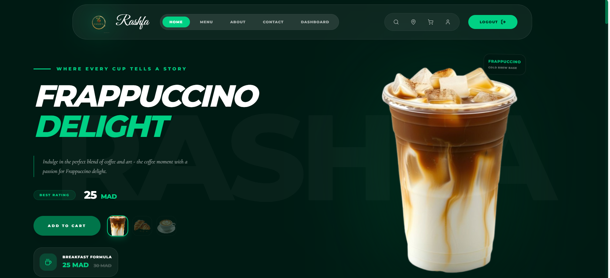

# ☕ RASHFA - Premium Coffee Experience

RASHFA is a high-end, modern e-commerce platform designed for a premium coffee brand. It offers a seamless and immersive shopping experience with a focus on rich aesthetics, smooth animations, and user-centric features.



## ✨ Key Features

- **🚀 Modern UI/UX**: Built with Framer Motion, GSAP, and Three.js for stunning visual effects and smooth transitions.
- **🛒 Advanced Shopping**: Dynamic cart management, product customizations (size, quantity), and category filtering.
- **🔍 Real-time Search**: Instant product search with visual results and smart navigation.
- **👤 User Profiles**: Comprehensive dashboard to manage orders, addresses, and payment methods.
- **💳 Secure Checkout**: A multi-step, robust checkout process with support for saved cards and addresses.
- **📱 Fully Responsive**: Optimized for all devices, from desktop to mobile.
- **🛡️ Admin Dashboard**: Dedicated portal for managing orders and tracking business performance.

## 🛠️ Technology Stack

- **Frontend**: React.js, TailwindCSS, Framer Motion, GSAP, Lucide React, Recharts.
- **Backend**: Express.js, JWT Authentication.
- **State Management**: React Hooks & LocalStorage.

---

## 🚀 Getting Started

Follow these steps to set up the project locally.

### 1. Clone the Repository
```bash
git clone https://github.com/aya123-nomany/Rashfa.git
cd Rashfa
```

### 2. Backend Setup (Express)
```bash
cd backend-express
npm install
cp .env.example .env
npm run dev
```

### 3. Frontend Setup (React)
```bash
cd ../frontend
cp .env.example .env
npm install
npm run dev
```

The application will be available at `http://localhost:5173`.

---

## 📄 License
This project is open-source and licensed under the MIT License.
